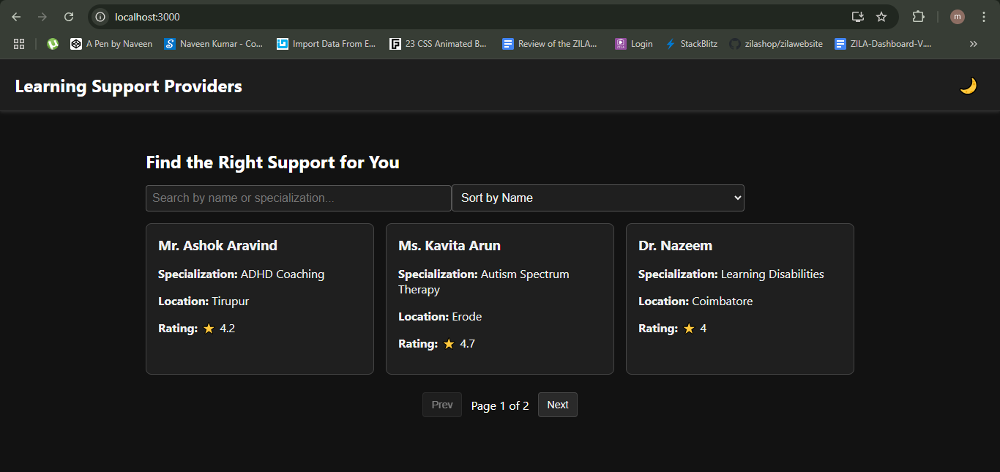
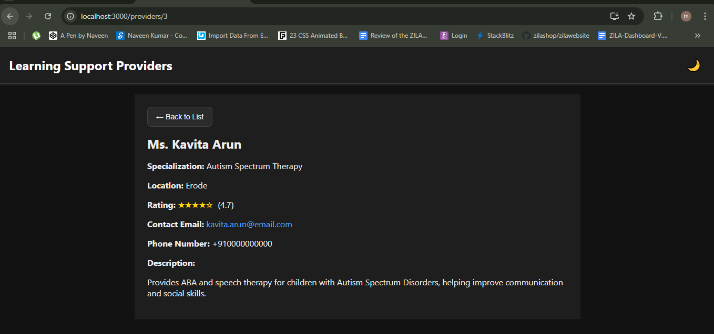

# Learning Support Provider Directory

A simplified directory module developed for **Habot Connect DMCC** to help parents easily browse and find learning support providers for children with learning difficulties.

## 🌟 Project Overview

This module provides:
- A list of learning support providers
- Search and filter by name or specialization
- Sorting by name or rating
- Paginated results
- Detailed provider profiles
- Dark mode toggle with animated icon
- Responsive design and sticky header
- 404 error handling for invalid routes

## 📁 Folder Structure

```
src/
│
├── components/
│   ├── Header/
│   ├── ProviderCard/
│   └── DarkModeToggle/
│
├── pages/
│   ├── ProviderList.js
│   └── ProviderDetail.js
│
├── utils/
│   └── fetchProviders.js
│
├── styles/
│   └── GlobalStyles.css
│
└── App.js
```

## 🚀 Getting Started

### Prerequisites

- Node.js (v14+ recommended)
- npm or yarn

### Installation

```bash
git clone https://github.com/your-username/learning-support-directory.git
cd learning-support-directory
npm install  # or yarn install
```

### Run Locally

```bash
npm start  # or yarn start
```

### Build for Production

```bash
npm run build  # or yarn build
```

## 🧩 Features

| Feature               | Description                                                                 |
|----------------------|-----------------------------------------------------------------------------|
| 🔍 Search             | Filter providers by name or specialization                                 |
| 📊 Sort               | Sort list by name or rating                                                |
| 📄 Pagination         | View paginated results (3 per page)                                        |
| 🌙 Dark Mode          | Toggle dark mode with a smooth icon animation                              |
| 📱 Responsive Design  | Mobile-friendly layout with sticky header                                  |
| ❌ Error Handling     | Displays 404 page if an invalid provider ID or route is accessed           |
| 🔗 Clickable Details  | Emails and phone numbers are clickable                                     |

## 📦 Sample Provider Data Format

```json
{
  "id": "123",
  "name": "Dr. Jane Doe",
  "specialization": "Speech Therapy",
  "location": "Dubai",
  "rating": 4.8,
  "contactEmail": "jane@example.com",
  "phoneNumber": "+971500000000",
  "longDescription": "Experienced therapist with 10+ years..."
}
```

## 📸 Screenshots





## 📄 License

This project is developed as part of a module for **Habot Connect DMCC**. Intended for demo and internal use.
